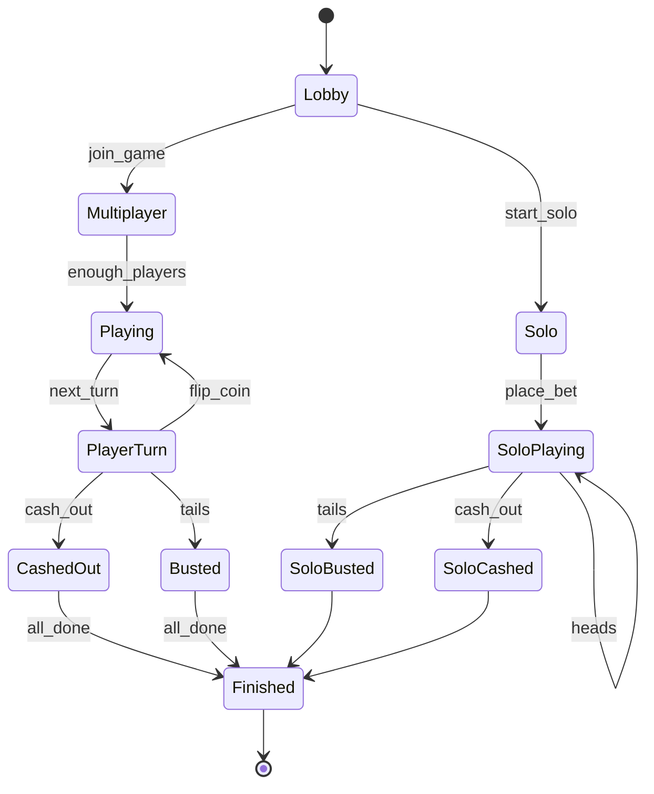
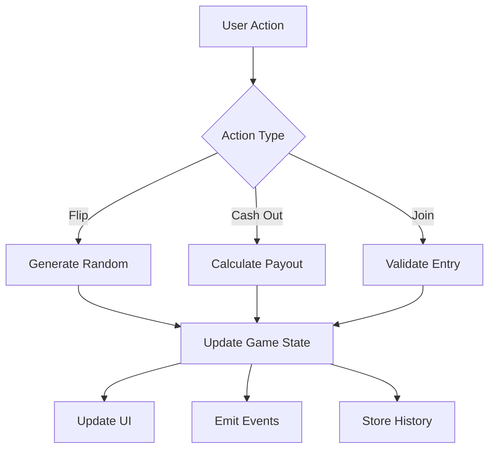

# 🛠 High Stakes Coin Flip Showdown - Technical Specifications

## 🔧 Architecture Overview

### Smart Contract
```solidity
// Core game state
struct GameState {
    string gameId;
    GameMode mode;
    GameStatus status;
    address[] players;
    uint256 potSize;
    uint256 houseFee;
    uint256 currentPlayerIndex;
    uint256 startTime;
    mapping(address => PlayerState) playerStates;
}

// Player state tracking
struct PlayerState {
    uint256 currentStreak;
    uint256 maxStreak;
    PlayerStatus status;
    uint256 joinTime;
    bool hasPaid;
}

// Game configuration
struct GameConfig {
    uint256 minBet;        // 1 PUMP
    uint256 maxBet;        // 100 PUMP
    uint256 entryFee;      // 5 PUMP
    uint256 houseFeeRate;  // 5%
    uint256 maxStreak;     // 7 (128x max)
    uint256 maxPlayers;    // 8
    uint256 turnTimeout;   // 30 seconds
}
```

### Frontend Architecture
```typescript
// Core state management
interface GameState {
    mode: 'lobby' | 'multiplayer' | 'solo' | 'finished';
    gameId: string | null;
    players: Player[];
    currentPlayer: string | null;
    potSize: number;
    houseFee: number;
    currentStreak: number;
    maxStreak: number;
    isPlayerTurn: boolean;
    gameStatus: GameStatus;
    winner: string | null;
    payoutAmount: number;
}

// UI state tracking
interface UIState {
    isLoading: boolean;
    error: string | null;
    modal: ModalConfig | null;
    notification: NotificationConfig | null;
    isFlipping: boolean;
    lastFlipResult: 'heads' | 'tails' | null;
}

// Wallet integration
interface WalletState {
    connected: boolean;
    address: string | null;
    balance: number;
    tokenBalance: number;
}
```

## 🎲 Game Mechanics

### Randomness Generation
```typescript
function generateCoinFlip(gameId: string, playerAddress: string): boolean {
    // Combine multiple sources of entropy
    const seed = [
        Date.now(),
        gameId,
        playerAddress,
        recentBlockhash,
        previousFlipResult
    ].join(':');
    
    // Generate hash
    const hash = sha256(seed);
    
    // Extract random bit
    const randomBit = parseInt(hash.substring(0, 8), 16) % 2;
    return randomBit === 0; // heads = true, tails = false
}
```

### Payout Calculation
```typescript
function calculatePayout(betAmount: number, streak: number): number {
    // Exponential payout structure
    const multiplier = Math.pow(2, streak);
    return betAmount * multiplier;
}

function validateHouseBalance(betAmount: number): boolean {
    const maxPayout = betAmount * Math.pow(2, MAX_STREAK);
    return houseBalance >= maxPayout;
}
```

## 🔐 Security Measures

### Rate Limiting
```typescript
const RATE_LIMITS = {
    JOIN_GAME: 1,    // 1 per second
    FLIP_COIN: 2,    // 2 per second
    CASH_OUT: 1,     // 1 per second
    NEW_GAME: 0.2    // 1 per 5 seconds
};

function checkRateLimit(action: GameAction, player: string): boolean {
    const now = Date.now();
    const lastAction = actionHistory.get(player)?.[action];
    
    if (!lastAction) return true;
    
    const timeDiff = now - lastAction;
    const minInterval = 1000 / RATE_LIMITS[action];
    
    return timeDiff >= minInterval;
}
```

### Transaction Validation
```typescript
async function validateTransaction(tx: Transaction): Promise<boolean> {
    // Check signature
    if (!verifySignature(tx)) return false;
    
    // Verify sufficient balance
    const balance = await getTokenBalance(tx.from);
    if (balance < tx.amount) return false;
    
    // Check for duplicate transactions
    if (isTransactionProcessed(tx.hash)) return false;
    
    // Validate game state
    if (!isValidGameState(tx.gameId)) return false;
    
    return true;
}
```

## 📱 Mobile Optimization

### Responsive Design
```css
/* Breakpoints */
const BREAKPOINTS = {
    mobile: '320px',
    tablet: '768px',
    desktop: '1024px',
    wide: '1440px'
};

/* Mobile-first media queries */
@media (min-width: ${BREAKPOINTS.mobile}) {
    .game-container {
        grid-template-columns: 1fr;
        padding: 1rem;
    }
}

@media (min-width: ${BREAKPOINTS.tablet}) {
    .game-container {
        grid-template-columns: 2fr 1fr;
        gap: 2rem;
        padding: 2rem;
    }
}
```

### Touch Controls
```typescript
interface TouchConfig {
    tapThreshold: number;     // 300ms
    swipeThreshold: number;   // 50px
    doubleTapDelay: number;   // 300ms
    longPressDelay: number;   // 500ms
}

function handleTouchGesture(event: TouchEvent): GameAction {
    const gesture = detectGesture(event);
    
    switch (gesture) {
        case 'tap': return 'flip';
        case 'swipe': return 'navigate';
        case 'doubleTap': return 'quickAction';
        case 'longPress': return 'showInfo';
        default: return null;
    }
}
```

## 🔄 State Management

### Game Flow


### Data Flow


## 📊 Analytics Integration

### Event Tracking
```typescript
interface GameEvent {
    type: GameEventType;
    timestamp: number;
    gameId: string;
    player: string;
    data: {
        action?: GameAction;
        result?: FlipResult;
        amount?: number;
        streak?: number;
    };
}

function trackEvent(event: GameEvent): void {
    // Log to analytics
    analytics.track(event.type, {
        ...event,
        sessionId,
        deviceInfo,
        networkInfo
    });
    
    // Store locally
    eventHistory.push(event);
    
    // Trigger webhooks
    notifyWebhooks(event);
}
```

### Performance Monitoring
```typescript
interface PerformanceMetrics {
    loadTime: number;
    ttfb: number;
    fcp: number;
    txConfirmation: number;
    frameRate: number;
    memoryUsage: number;
}

function monitorPerformance(): void {
    // Core Web Vitals
    reportWebVitals();
    
    // Game-specific metrics
    measureGameMetrics();
    
    // Network latency
    trackNetworkLatency();
    
    // Transaction times
    measureTxTimes();
}
```

## 🚀 Deployment Pipeline

### Build Process
```yaml
build:
  steps:
    - name: Install dependencies
      run: npm install
      
    - name: Type check
      run: tsc --noEmit
      
    - name: Lint
      run: eslint .
      
    - name: Test
      run: jest --coverage
      
    - name: Build
      run: npm run build
      
    - name: Optimize
      run: npm run optimize
      
    - name: Deploy
      run: npm run deploy
```

### Testing Strategy
```typescript
describe('Game Logic', () => {
    test('Solo Mode', async () => {
        // Setup
        const game = new Game('solo');
        const player = new Player();
        
        // Place bet
        await game.placeBet(player, 10);
        expect(game.pot).toBe(10);
        
        // Simulate flips
        const results = await simulateFlips(game, 5);
        expect(results).toMatchSnapshot();
        
        // Verify payouts
        const payout = await game.cashOut(player);
        expect(payout).toBe(expectedPayout);
    });
});
```

## 📱 PWA Configuration
```json
{
    "name": "High Stakes Coin Flip",
    "short_name": "CoinFlip",
    "start_url": "/",
    "display": "standalone",
    "background_color": "#1a1a2e",
    "theme_color": "#ffd700",
    "icons": [
        {
            "src": "icon-192.png",
            "sizes": "192x192",
            "type": "image/png"
        },
        {
            "src": "icon-512.png",
            "sizes": "512x512",
            "type": "image/png"
        }
    ]
}
```

## 🔧 Environment Configuration
```typescript
const CONFIG = {
    development: {
        network: 'devnet',
        rpcUrl: 'https://api.devnet.solana.com',
        wsUrl: 'wss://api.devnet.solana.com',
        houseFee: 0.05,
        maxBet: 100,
        debug: true
    },
    production: {
        network: 'mainnet',
        rpcUrl: 'https://api.mainnet-beta.solana.com',
        wsUrl: 'wss://api.mainnet-beta.solana.com',
        houseFee: 0.05,
        maxBet: 100,
        debug: false
    }
};
```

## 📈 Scaling Considerations

### Load Balancing
- Multiple RPC nodes
- WebSocket connection pooling
- Redis caching layer
- State channel optimization

### Database Sharding
- Game history partitioning
- Player data sharding
- Transaction log rotation
- Analytics aggregation

### Performance Optimization
- Code splitting
- Asset compression
- CDN distribution
- Service worker caching

## 🔒 Security Checklist

### Smart Contract
- [ ] Audit completed
- [ ] Emergency stops
- [ ] Rate limiting
- [ ] Access controls
- [ ] Balance checks
- [ ] Overflow protection

### Frontend
- [ ] Input validation
- [ ] XSS prevention
- [ ] CSRF protection
- [ ] Secure storage
- [ ] Error handling
- [ ] Rate limiting

### Network
- [ ] SSL/TLS
- [ ] DDoS protection
- [ ] API authentication
- [ ] Request validation
- [ ] Response sanitization
- [ ] Logging/Monitoring

## 📚 API Documentation

### REST Endpoints
```typescript
// Game endpoints
POST   /api/games/create
GET    /api/games/:id
POST   /api/games/:id/join
POST   /api/games/:id/flip
POST   /api/games/:id/cashout

// Player endpoints
GET    /api/players/:address
GET    /api/players/:address/history
GET    /api/players/:address/stats

// Leaderboard endpoints
GET    /api/leaderboard/daily
GET    /api/leaderboard/weekly
GET    /api/leaderboard/alltime
```

### WebSocket Events
```typescript
// Game events
GAME_CREATED
PLAYER_JOINED
FLIP_RESULT
PLAYER_CASHED_OUT
GAME_FINISHED

// Player events
WALLET_CONNECTED
BALANCE_UPDATED
STREAK_UPDATED
ACHIEVEMENT_UNLOCKED

// System events
MAINTENANCE_START
MAINTENANCE_END
EMERGENCY_STOP
SYSTEM_RESUMED
```

---

*This technical specification is subject to change and improvement based on development needs and community feedback.* 